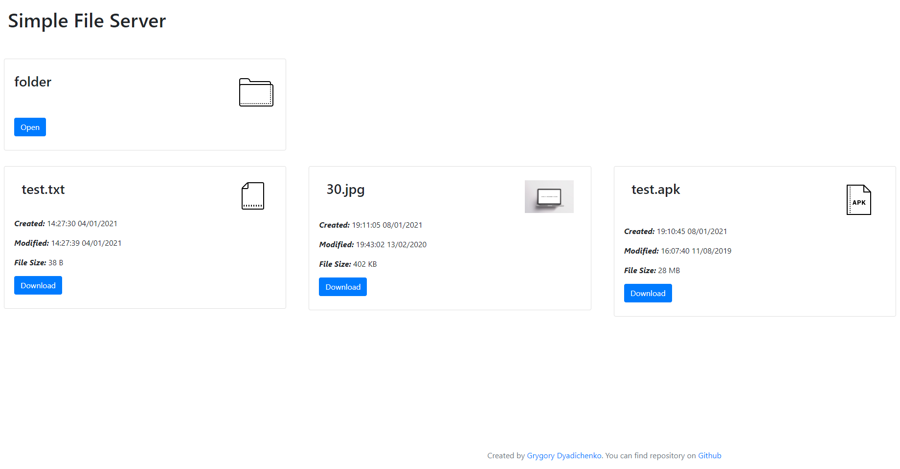

# Simple Builds Server - Flask + Jinja + Boostrap

Простая утилита для удобного локального скачивания файлов и билдов с мобильных устройств или же между десктопами. Представляет из себя файловый веб-сервер с mobile-friendy интерфейсом для скачивания файлов.
Рекомендованная версия Python 3.5 или 2.7.

## Простая установка

Запустить launch_server_mac.sh или launch_server_win.sh в зависимости от операционной системы устройства. Сервер откроется на ip вашего компьютера и порте 8082. Чтобы открыть страницу с файлами в браузере необходимо ввести в строку адреса YourPCIP:8082

## Сложная установка

В случае проблем с шелл скриптами, либо какого-то более сложного случая, можно запустить обратившись к документации Flask https://flask.palletsprojects.com/en/1.1.x/installation/#install-flask

## Файл конфигурации

В файле config.json в поле folderToIndex указывается путь до каталога файлы которого нужно отобразить в веб интерфейсе.
